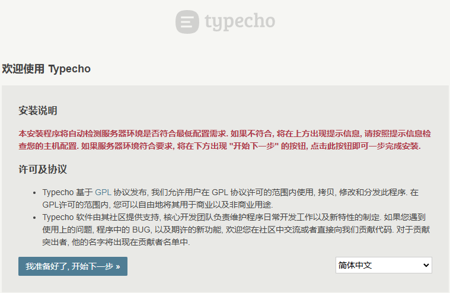
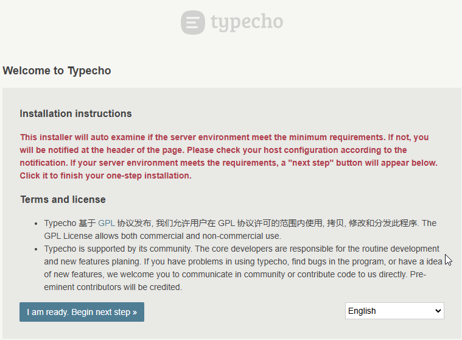
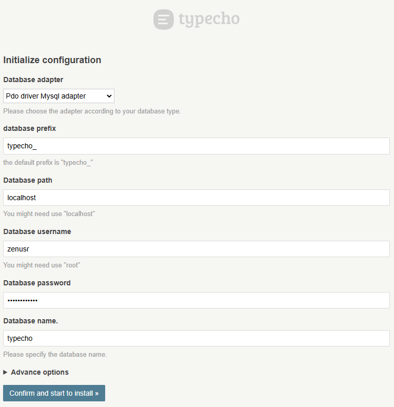
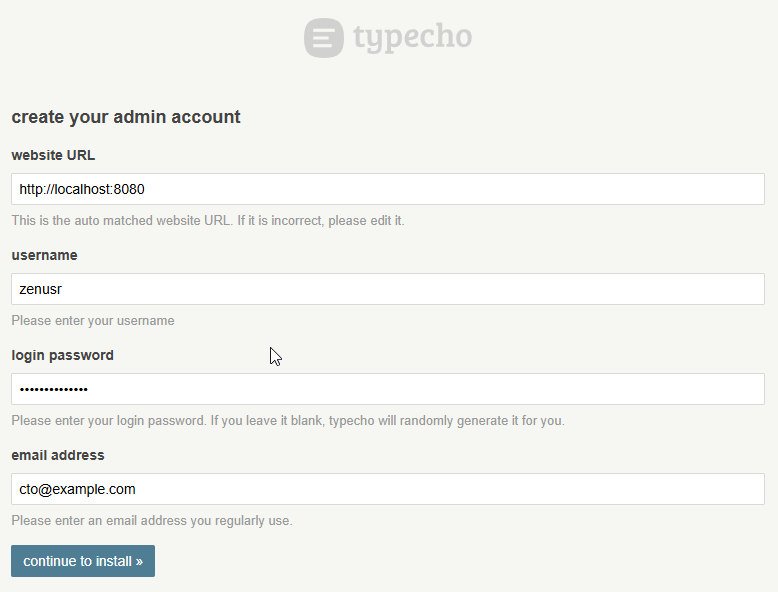
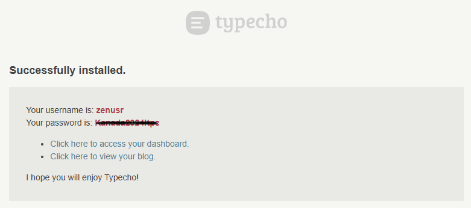

# Dockerize Nginx, MariaDB and PHP for Typecho Blog Projects

by Marcus Zou | 16 Feb 2025 | 3 minutes Reading - 20 minutes Hands-on


## Intro

It's been a while since I decided to migrate my Blog from [LAMP](https://www.ibm.com/think/topics/lamp-stack)+[WordPress](https://www.ibm.com/think/topics/lamp-stack) to [LEMP](https://www.geeksforgeeks.org/what-is-lemp-stack/)+[Typecho](https://typecho.org). Then this is a wrap-up of what I have accomplished in the last few days.


## Prerequisites

- Linux: Debian or Ubuntu preferred, WSL2 distro works well
- Docker Engine/Desktop installed


## Quick-Start

1. Git clone my repo: https://github.com/marcuszou/lemp-typecho.git.

   ```shell
   git clone https://github.com/marcuszou/lemp-typecho.git
   ```

2. Fine tune the `docker-compose.yml` as needed.

   ```shell
   sudo chown -R $USER:$USER ./lemp-typecho
   cd lemp-typecho
   nano docker-compose.yml
   ```

3. Fire up the docker containers. 

   ```shell
   docker compose up -d
   ```

   Docker will pull down the relevant images and start the containers, which will take some time.

4. Access the website via http://localhost:8080 or http://127.0.0.1:8080.


## Further Setup the Typecho Blog System

1. Once the web UI is up, a __Chinese__ interface will be presented since this free product is made by Chinese geeks. Click the "Language" drop-down menu to find your fav language, say __English__.

   

2. Then you will be presented with:

   

3. Configure the Database connection as below: 

   Please note: (1) the "__database path__" is __localhost__ (or 127.0.0.1) if you setup the `./db/env/mysql.env` in the similar manner as what I do (__CREATE USER 'zenusr'@'localhost'__), otherwise use `mariadb` as database path and `root` as database user.

   

4. Create your admin account: This is not something about the database, but the website, then remember the new username and password you created here for future logging into the website.

   

5. Hola! Your `Typecho Blog System` is successfully installed.

   


## Detailed Notes: How to dockerize this LEMP Stack

A detailed note can be found at [Step-by-Step Guide](Step-by-Step-Guide-LEMP.md). Feel free to distribute if you find it helpful.


## Tech Stack and Notes

* This repo provides containers with Tech Stack:
    * __Linux__: Debian/Ubuntu is preferred, but it shouldn't matter much as far as you have a Docker Engine/Desktop installed
    * __Nginx__:latest (could select nginx: alpine for a smaller sized container)
    * __MariaDB__:10.11 (LTS, selected) or MariaDB:11.4 (LTS) or MySQL:8.0.38-Debian
    * __PHP__:8.1-FPM (customized with quite a bunch of PHP extensions)
* Code in the `www` directory will be mapped into the Nginx container at `/var/www/html`
* Nginx will grab code from the `www` directory.
    * By default, `www/html/index.php` will provide you a `phpinfo()` report once mapped.
    * Current `Typecho` blog system is served at `www/typecho/` folder, to be mapped to `/var/www/html/` in the containers.
* If you want to use this repo for your dev, it is suggested you customize per your own project env.


## Future Implementation: local SSL

* There are default passwords for MariaDB's `root` user and `zenusr` user specified in `docker/docker-compose.yml` or `./db/env/mysql.env`.
* You are strongly recommended to edit this `./db/env/mysql.env` to replace the passwords as needed.

* This docker configuration has not been security consolidated (with ssl). Expose it to public networks at your own risk!
* If you place the containers in the Cloud Service Providers (AWS, GCP, Azure, Digital Ocean, etc.), the SSL question will taken care by them automatically.
* If you place them in a home NAS, you could manage the SSL with Nginx Proxy Manager via Let's Encrypt service.


## License

* MIT
