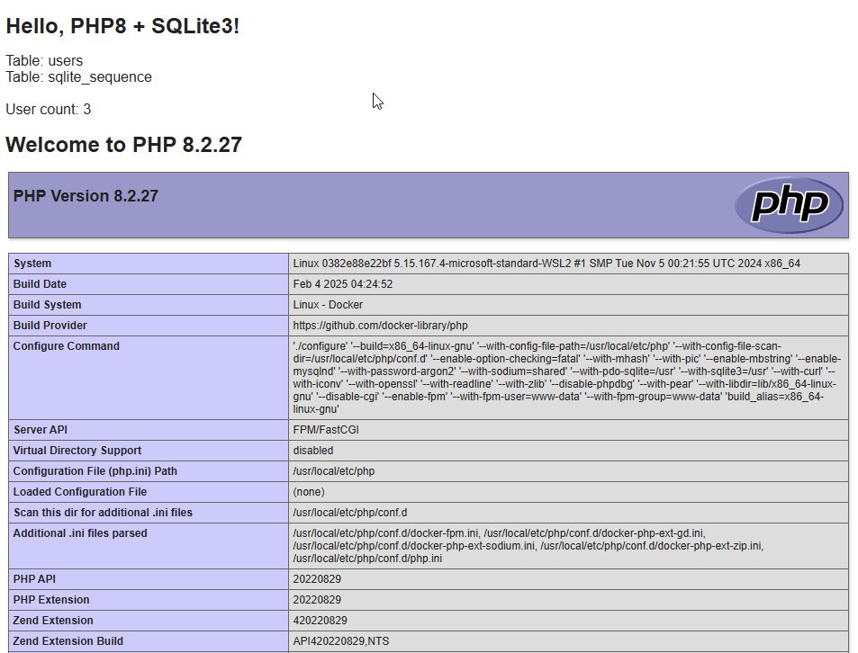

# Syep-by-Step Guide to LEMP (Nginx-MySQL-PHP)
**This guide shows you how to set up your LEMP (Linux, Nginx, MySQL/MariaDB, PHP) stack easily and quickly using Docker Compose.**

by Marcus Zou | 18 Feb 2025


## Intro

When it comes to application development, containers are now the standard approach. They are popular among software developers due to their flexibility and portability.

The LEMP stack is an open-source solution used to develop web applications. It is an acronym representing Linux, Nginx, MySQL/MariaDB, and PHP. In addition, it is widely popular and well-supported among the Open Source community.

However, installing and configuring all of these services takes time and skills. This is where Docker containers, specifically Docker Compose, come in. With its help, you can have your LEMP stack up and running in minutes and focus entirely on developing web apps without wasting time installing and configuring services.


But if you still prefer to take the traditional approach and install the LEMP stack from the native packages for the distro you are using, feel free to do so.

This guide will show you how to quickly and easily integrate Nginx, MySQL/MariaDB, and PHP using Docker Compose. In addition, we’ll add the popular web-based application phpMyAdmin to the LEMP stack to manage your MySQL/MariaDB database.

So without further ado, let’s get to work.


## Prerequisites

Of course, having Docker and Docker Compose plugin installed is required to deploy a containerized LEMP stack. Actually I am currently on __WSL2 Ubuntu 22.04__ with [Docker Engine](https://docs.docker.com/engine/install/ubuntu/) installed. I also like the settings of __WSL2 Debian 12-bookworm__ with [Docker Engine](https://docs.docker.com/engine/install/debian/).

Next, run the command below to ensure that Docker Compose is installed and functioning correctly.

```shell
docker -- version
## Docker version 27.5.1, build 9f9e405
docker compose version
## Docker Compose version v2.32.4
```


## Set up Nginx, MariaDB, and PHP Stack with Docker Compose
I would like to go through the whole process in a step-by-step manner. Let's roll up the sleeves.

### 1- Folder Structure Design and Realization

The folder structure could be designed as below:


Create the folder structure and files.

```shell
## create project folder
mkdir lemp-demo
cd lemp-demo
## generate sub-folders
mkdir -p db/{conf,data,env,logs} init nginx/{conf,logs} php www/html
## generate files
touch README.md docker-compose.yml init/initdb.sql nginx/conf/default.conf 
touch db/{conf/my.cnf,env/mysql.env} 
touch php/{Dockerfile,php.ini,php-log.conf} www/html/index.php
## display the folder/files structure
tree
```

Here is the output of last command above: Exactly same as what we designed, fantastic, isn't it?

```shell
.
├── README.md
├── db
│   ├── conf
│   │   └── my.cnf
│   ├── data
│   ├── env
│   │   └── mysql.env
│   └── logs
├── docker-compose.yml
├── init
│   └── initdb.sql
├── nginx
│   ├── conf
│   │   └── default.conf
│   └── logs
├── php
│   ├── Dockerfile
│   ├── php-log.conf
│   └── php.ini
└── www
    └── html
        └── index.php
```


### 2- Create an Nginx Container

Before starting, you must create and launch an Nginx container to host the PHP application.

```shell
## edit the docker-compose.yml file
nano docker-compose.yml
```

Add the following lines as a starter:

```shell
services:
  nginx:
    container_name: web
    image: nginx:latest
    ports:
      - 8080:80
```

The above file will download the latest Nginx image, create an Nginx container (internal port 80), and expose it on port 8080.

Next, launch the Nginx container with the following command:

```
## In NAS
docker-compose up -d
## or in Ubuntu/Debian
docker compose up -d
```

You can check the running container with the following command:

```
docker ps -a
```

You should see the following output:

> CONTAINER ID   IMAGE            COMMAND                      CREATED             STATUS             PORTS                           NAMES
> 
> 9ae6179481c9   nginx:latest   "/docker-entrypoint.…"   4 minutes ago   Up 4 minutes   0.0.0.0:8080->80/tcp   web

Now, open your web browser and access your Nginx container using the URL **http://localhost:8080**. You should see the Nginx test page on the following screen:


### 3- Create a PHP Container

3.1 - First, edit the `www/html/index.php` file to verify your PHP version.

```
nano www/html/index.php
```

Add the following lines:

```
<!DOCTYPE html>
<html>
    <head>
        <title>Hello World!</title>
    </head>

    <body>
        <h1>Hello World!</h1>
        <p><?php echo 'We are running PHP, version: ' . phpversion(); ?></p>
    </body>
</html>
```

Save and close the file.

3.2 - Then edit the Nginx default configuration file to run your PHP application:

```
nano nginx/conf/default.conf
```

Add the following lines:

```
server {

    listen 80 default_server;
    root /var/www/html;
    index index.html index.php;

    charset utf-8;
     
    location / {
        try_files $uri $uri/ /index.php?$query_string;
    }

    location = /favicon.ico { access_log off; log_not_found off; }
    location = /robots.txt { access_log off; log_not_found off; }

    access_log off;
    error_log /var/log/nginx/error.log error;

    sendfile off;

    client_max_body_size 100m;

    location ~ .php$ {
        fastcgi_split_path_info ^(.+.php)(/.+)$;
        fastcgi_pass php:9000;
        fastcgi_index index.php;
        include fastcgi_params;
        fastcgi_param SCRIPT_FILENAME $document_root$fastcgi_script_name;
        fastcgi_intercept_errors off;
        fastcgi_buffer_size 16k;
        fastcgi_buffers 4 16k;
    }

    location ~ /.ht {
        deny all;
    }
}
```

Save and close the file.

3.3 - Edit the `docker-compose.yml` file:

```
nano docker-compose.yml
```

Modify the contents while bringing in the `php` container:

```
# Services
services:

  # Nginx Service
  nginx:
    container_name: web
    image: nginx:latest
    ports:
      - 8080:80
    links:
      - 'php'
    volumes:
      - ./www/html/:/var/www/html/
      - ./nginx/conf/:/etc/nginx/conf.d/
    depends_on:
      - php

  # PHP-FPM Service
  php:
    container_name: php8
    image: php:8.2-fpm
    expose:
      - 9000
    volumes:
      - ./www/html/:/var/www/html/
```

Save and close the file when you finish.

The above file will 

- create a new PHP container (based on docker image: `php:8.2-pfm`), expose PHP-FPM on port 9000, 
- link the Nginx container to PHP container, 
- pour the `./nginx/conf/default.conf` file to the Nginx container at `/etc/nginx/conf.d/` folder, 
- map and mount the volume to the PHP container so that all content at `./www/html` folder will be in sync with the container’s directory `/var/www/html/`.

Now, launch the containers with the following command:

```
docker compose up -d
```

You can verify the running containers with the following command:

```
docker ps -a
```

You should see the following output:

> CONTAINER ID   IMAGE          COMMAND                  CREATED              STATUS              PORTS                                 NAMES
> 
> 3d80d69f9582   nginx:latest   "/docker-entrypoint.…"   2 minute ago   Up 1 minute   0.0.0.0:8080->80/tcp        web
> 
> 09d0a9ac59ac   php:8.2-fpm    "docker-php-entrypoi…"   2 minutes ago   Up 1 minute   9000/tcp                       php8

Now, open your web browser and access the URL **http://localhost:8080**. You should see your Hello World page:


Next, we will check whether our mounted volume works or not. To do so, edit the `./www/html/index.php` file:

```
nano www/html/index.php
```

Change the line “Hey folks, I am going to showcase the PHP information sheet below:”, also modify the next line with `phpinfo()` function:

```
<!DOCTYPE html>
<html>
    <head>
        <title>Hello World!</title>
    </head>
    <body>
        <h1>Hey folks, I am going to showcase the PHP information sheet below:</h1>
        <p><?php phpinfo(); ?></p>
    </body>
</html>
```

Now, refresh your web page. You should see your modified page on the screen:




## 4– Create a MySQL/MariaDB Container


Generally speaking, MySQL database was bought over by Oracle, which is phasing it to MySQL Enterprise, while some techies in Oracle are maintaining the MySQL community edition. Alternatively, MariaDB is a perfect replacement of MySQL due to the active development by the community. I always prefer MariaDB other than MySQL nowadays. Here is the comparison table of the two.

| Product     | Version       | Release Date | Remarks            | Latest Edition        |
| ----------- | ------------- | ------------ | ------------------ | --------------------- |
| MySQL       | 8.0.35        | 25 Oct 2023  | Oracle Linux based | 8.0.41 (21 Jan 2025)  |
|             | 8.0.35-debian | 25 Oct 2023  | Debian Based       | 8.0.41 (21 Jan 2025)  |
| __MariaDB__ | __10.11__     | 6 Feb 2023   | LTS, Ubuntu based  | 10.11.11 (4 Feb 2025) |
|             | 11.4          | 14 Dec 2023  | LTS, Ubuntu based  | 11.4.3 (14 Aug 2024)  |

Please note, 

- If specifying MariaDB version in 2 digits only, e.g.: "10.11", it points to the latest minor version of "10.11.11". 
- The MySQL container has quite some issues than MariaDB, for instance, (1) the old way of configuring socket via `my.cnf` file, (2) MySQL container crashes and it's very hard to trouble-shoot, while the regular installing in Linux has no such issue.
- The MySQL container is almost twice big-sized against MariaDB container (600MB vs. 330MB).
- Configuring `my.cnf` file is not needed if using MariaDB.


Now we will create a MySQL database container and link it to all other containers.

__4.1__ - First, we must modify the PHP image and install the PHP extensions for driving PHP to connect to the MySQL/MariaDB database. So, edit the `php/Dockerfile` to build a **custom PHP image** while installing the PHP extensions:

```
nano php/Dockerfile
```

Add the following lines:

```
FROM php:8.2-fpm

# Installing dependencies for the PHP modules
RUN apt-get update
RUN apt-get install -y git curl nano libbz2-dev libzip-dev libcurl3-dev libssl-dev libjpeg62-turbo-dev libpng-dev libonig-dev libxml2-dev unzip zip
# libonig-dev is needed for oniguruma which is needed for mbstring

# Installing additional PHP extensions to drive up MySQL/MariaDB
RUN docker-php-ext-install curl gd mbstring mysqli pdo pdo_mysql xml zip
```

Save and close the file. 

Also configure the php-fpm by `nano php/php.ini`, which will be mapped in the `docker-compose.yml` later.

```shell
date.timezone=UTC
display_errors=On
log_errors=On
upload_max_filesize= 80M
post_max_size= 80M
memory_limit = 256M
```

And configure the logs by `nano php/php-log.conf`, which will also be mapped later.

```shell
php_admin_flag[log_errors] = on
php_flag[display_errors] = off
```

__4.2__ - Creating a test database is needed while firing up the `mysql` database container since we are going to connect to such for a test of connectivity. So edit the `init/initdb.sql` file and load it up later into the `mysql` database container. 

__Please note__: This step is just for test the PHP function accessing MySQL/MariaDB database records only. So you don't need to add the `initdb.sql` script in first place to create database in MySQL/MariaDB container since the famous CMS/Blog layers (WordPress, Typecho, etc.) have decent build-in intractability against database. 

```shell
nano init/initdb.sql
```

Here are the contents of the SQL script:

```shell
CREATE DATABASE IF NOT EXISTS testdb;
CREATE DATABASE IF NOT EXISTS devdb;
CREATE DATABASE IF NOT EXISTS proddb;
CREATE USER 'zenusr'@'localhost' IDENTIFIED BY 'userP@ss2024';
GRANT ALL PRIVILEGES ON `testdb`.* TO 'zenusr'@'%' WITH GRANT OPTION;
GRANT ALL PRIVILEGES ON `devdb`.* TO 'zenusr'@'%' WITH GRANT OPTION;
GRANT ALL PRIVILEGES ON *.* TO 'root'@'%';
FLUSH PRIVILEGES;
```

Please note, 

- we created three databases `testdb`, `devdb`, and `proddb` using the root user (by default);
- created a `zenusr` user with password ("@'%'" means: MySQL treats '%' as a wildcard matching any client who connects via TCP. So any hostname or any IP address, including 127.0.0.1);
- intentionally, we assigned `zenusr` to 2 databases only: `testdb` and `devdb`, while `root` user can access all of the databases, since we are going to test and compare the connectivity via different users: `zenusr` and `root`. 
- obviously, `zenusr` cannot access `proddb` database due to lack of privileges.

__4.3__ - Update the MySQL/MariaDB env file at `db/env/mysql.env`:

```shell
nano db/env/mysql.env
```

And the contents be like:

```shell
MYSQL_ROOT_PASSWORD=rootP@ss2024
MYSQL_USER=zenusr
MYSQL_PASSWORD=userP@ss2024
```

__4.4__ - Edit the `docker-compose.yml` file to create a MySQL container and build PHP container to hold the database and tables:

```
nano docker-compose.yml
```

Make the following changes:

```
# Services
services:

  # Nginx Service
  nginx:
    container_name: web
    image: nginx:latest
    restart: always
    ports:
      - 8080:80
    links:
      - php
    volumes:
      - ./www/html/:/var/www/html/
      - ./nginx/conf/:/etc/nginx/conf.d/
      - ./nginx/conf/:/var/log/nginx/
    depends_on:
      - php
      - mariadb
    networks:
      - lemp-demo

  # PHP-FPM Service
  php:
    container_name: php8
    build: php
    restart: always
    expose:
      - 9000
    volumes:
      - ./www/html/:/var/www/html/
      - ./php/php-log.conf:/usr/local/etc/php-fpm.d/zz-log.conf
      - ./php/php.ini:/usr/local/etc/php/conf.d/php.ini
    depends_on:
      - mariadb
    networks:
      - lemp-demo

  # MariaDB Service
  mariadb:
    container_name: mariadb
    image: mariadb:10.11
    restart: always
    expose:
      - 3306:3306
    env_file:
      - ./db/env/mysql.env
    volumes:
      - ./init/initdb.sql:/docker-entrypoint-initdb.d/initdb.sql
      - ./db/data/:/var/lib/mysql/
      - ./db/logs/:/var/log/mysql/
    networks:
      - lemp-demo

# Networks
networks:
  lemp-demo:
```

Save and close the file.

Please note the changes in the `docker-compose.yml` file:

- modified `image:8.2-fpm` to `build: php` in the `php` container part since we will build the php-fpm as the file: `php/Dockerfile`,
- linked `php` container to `mysql` container using `depends_on` function,
- created the `mysql` container and please notice the passwords for `zenusr` and `root` user of the MySQL database,
- Introduced the `initdb.sql` script to create a database in the first place for later test in `mysql` container,
- Added `networks` section which bind all containers into the same network.


__4.5__ - Edit the **`www/html/index.php`** file and make changes to test the database connection.

```
nano www/html/index.php
```

Make the following changes:

```
<!DOCTYPE html>
<html>
	<head><title>Hello PHP8!</title></head>
    <body>
        <h1>Hello, PHP!</h1>
        <?php
            $dsn = 'mysql:dbname=proddb;host=mariadb';
            $user = 'zenusr';
            $password = 'userP@ss2024';
            
            try {
                $pdo = new PDO($dsn, $user, $password);
                /* @var $pdo PDO */
                echo "Current Connected Database: " . $pdo->query("select database()")->fetchColumn() . " by user: " . $user;
            } catch (PDOException $e) {
                echo 'Connection failed: ' . $e->getMessage();
            }
        ?>
        <h1>PHP Information Sheet:</h1>
        <p><?php phpinfo(); ?></p>
    </body>
</html>
```

Please note, the `host` is neither `localhost` nor `127.0.0.1`, but `mariadb` - that's the name of service in the `docker-compose.yml`, weird, huh?, but it is what it is.

Save and close the file. 

__4.6__ - then launch the container with the following command:

```
docker compose up -d
```

Due to the long time needed to build a custom PHP image and container, this part may take quite a time, so be patient.

Verify all running containers with the following command:

```
docker images
## There must be a new custom image named as "lemp-demo-php".
## REPOSITORY      TAG       IMAGE ID       CREATED          SIZE
## lemp-demo-php   latest    8193b9dc9457   57 seconds ago   605MB
## nginx           latest    41f689c20910   4 weeks ago      192MB
## mariadb         10.11     406d3edaa460   5 weeks ago      327MB
## php             8.2-fpm   74cc8d2d610a   5 weeks ago      490MB
docker ps -a
## There are 3 containers now.
## CONTAINER ID   IMAGE           COMMAND                   CREATED          STATUS          PORTS                  NAMES
## 4efdda201930   nginx:latest    "/docker-entrypoint.…"    48 seconds ago   Up 39 seconds   0.0.0.0:8080->80/tcp   web
## 0cd2a27c448a   lemp-demo-php   "docker-php-entrypoi…"    51 seconds ago   Up 42 seconds   9000/tcp               php8
## d3e0f477367e   mariadb:10.11   "docker-entrypoint.s…"    55 seconds ago   Up 45 seconds   0/tcp, 3306/tcp        mariadb
```

Also access **http://localhost:8080** to take a look. Obviously the `zenusr` user can access database: `testdb`.


But `proddb` is not accessible.


__4.7__ - More Connection Test

However, the `root` user can access all of the databases if you edit the `www/html/index.php` file by changing **$user** to **“root”** and **$password** to **“rootP@ss2024”**.

```
nano www/html/index.php
```

Change the following line:

```
$user = "root";  
$password = "rootP@ss2024";  
```

Save and close the file, then refresh the page. You should "see" the database `proddb` with `root` user:


### 5- Final Touch-up

The final touch-up is to hook up the [phpMyAdmin](https://phpmyadmin.net). 

phpMyAdmin is a free software tool written in [PHP](https://php.net/), intended to handle the administration of [MySQL](https://www.mysql.com/) over the Web. phpMyAdmin supports a wide range of operations on MySQL and MariaDB. Frequently used operations (managing databases, tables, columns, relations, indexes, users, permissions, etc) can be performed via the user interface, while you still have the ability to directly execute any SQL statement.

Nothing special, just simply add a service named "`phpmyadmin`" in the end of the `docker-compose.yml` file.

```shell
  ......

  # phpMyAdmin Service
  phpmyadmin:
      container_name: phpadm
      image: phpmyadmin/phpmyadmin:latest
      restart: always
      ports:
        - 8090:80
      environment:
        PMA_HOST: mariadb
      depends_on:
        - mariadb
      networks:
        - lemp-demo

# Networks
networks:
  lemp-demo:
```

Then fire up the dockers by:
```
docker compose up -d
```
And access __http://localhost:8080__ for the web and __http://localhost:8090__ for the phpMyAdmin site (log in as `root` and its password).


And the Admin GUI:


### 6- Environment Restoration

6.1 take down all containers

```shell
## To remove all comtainers created by this docker-compose.yml file, do:
docker compose down

## Alternatively remove all containers created by any yml files, do:
## docker stop $(docker ps -q)
## docker rm $(docker ps -q)
```

6.2 remove newly-created image

```shell
docker images
docker image rm $(docker images -q)
```

6.3 remove some left-over folders and files

```shell
sudo rm -rf db/data/*
sudo rm -rf nginx/logs/*
## As needed
sudo rm www/html/config.inc.php
```


## Conclusion

In the above guide, you learned how to deploy a PHP application with Nginx and MySQL using Docker and Docker Compose. You should now be able to host the PHP application in the production environment with Docker.


## Outro

License: MIT
