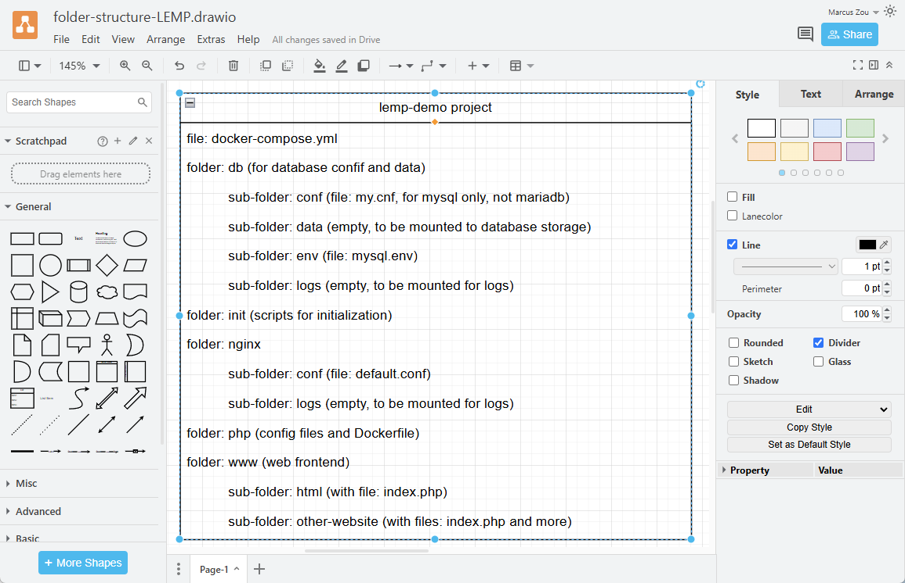
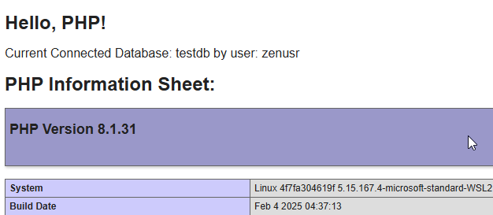

# Syep-by-Step Guide to LEMP (Nginx-MySQL-PHP)
**This guide shows you how to set up your LEMP (Linux, Nginx, MySQL/MariaDB, PHP) stack easily and quickly using Docker Compose.**

by Marcus Zou | 18 Feb 2025


## Intro

When it comes to application development, containers are now the standard approach. They are popular among software developers due to their flexibility and portability.

The LEMP stack is an open-source solution used to develop web applications. It is an acronym representing Linux, Nginx, MySQL/MariaDB, and PHP. In addition, it is widely popular and well-supported among the Open Source community.

However, installing and configuring all of these services takes time and skills. This is where Docker containers, specifically Docker Compose, come in. With its help, you can have your LEMP stack up and running in minutes and focus entirely on developing web apps without wasting time installing and configuring services.


But if you still prefer to take the traditional approach and install the LEMP stack from the native packages for the distro you are using, feel free to do so.

This guide will show you how to quickly and easily integrate Nginx, MySQL/MariaDB, and PHP using Docker Compose. In addition, we’ll add the popular web-based application phpMyAdmin to the LEMP stack to manage your MySQL/MariaDB database.

So without further ado, let’s get to work.


## Prerequisites

Of course, having Docker and Docker Compose plugin installed is required to deploy a containerized LEMP stack. Actually I am currently on __WSL2 Ubuntu 22.04__ with [Docker Engine](https://docs.docker.com/engine/install/ubuntu/) installed. I also like the settings of __WSL2 Debian 12-bookworm__ with [Docker Engine](https://docs.docker.com/engine/install/debian/).

Next, run the command below to ensure that Docker Compose is installed and functioning correctly.

```shell
docker -- version
## Docker version 27.5.1, build 9f9e405
docker compose version
## Docker Compose version v2.32.4
```


## Set up Nginx, MariaDB, and PHP Stack with Docker Compose
I would like to go through the whole process in a step-by-step manner. Let's roll up the sleeves.

### 1- Folder Structure Design and Realization

The folder structure could be designed as below:



Create the folder structure and files.

```shell
## create project folder
mkdir lemp-demo
cd lemp-demo
## generate sub-folders
mkdir -p dbdata init nginx/conf nginx/logs php www/html
## generate files
touch README.md docker-compose.yml init/initdb.sql nginx/conf/default.conf 
touch php/Dockerfile php/php.ini php/php-log.conf www/html/index.php
## display the folder/files structure
tree ../lemp-demo
```

Here is the output of last command above: Exactly same as what we designed, fantastic, isn't it?

```shell
../lemp-demo
├── README.md
├── dbdata
├── docker-compose.yml
├── init
│   └── initdb.sql
├── nginx
│   ├── conf
│   │   └── default.conf
│   └── logs
├── php
│   ├── Dockerfile
│   ├── php-log.conf
│   └── php.ini
└── www
    └── html
        └── index.php
```


### 2- Create an Nginx Container

Before starting, you must create and launch an Nginx container to host the PHP application.

```shell
## edit the docker-compose.yml file
nano docker-compose.yml
```

Add the following lines as a starter:

```shell
services:
  nginx:
    image: nginx:latest
      container_name: web
      ports:
        - 8080:80
```

The above file will download the latest Nginx image, create an Nginx container (internal port 80), and expose it on port 8080.

Next, launch the Nginx container with the following command:

```
docker-compose up -d
```

You can check the running container with the following command:

```
docker ps -a
```

You should see the following output:

> CONTAINER ID   IMAGE          COMMAND                  CREATED         STATUS         PORTS          NAMES
> 9ae6179481c9   nginx:latest   "/docker-entrypoint.…"   4 minutes ago   Up 4 minutes   0.0.0.0:8080->80/tcp, [::]:8080->80/tcp   web

Now, open your web browser and access your Nginx container using the URL **http://localhost:8080**. You should see the Nginx test page on the following screen:


### 3- Create a PHP Container

3.1 - First, edit the `www/html/index.php` file to verify your PHP version.

```
nano ./www/html/index.php
```

Add the following lines:

```
<!DOCTYPE html>
<head>
	<title>Hello World!</title>
</head>

<body>
	<h1>Hello World!</h1>
	<p><?php echo 'We are running PHP, version: ' . phpversion(); ?></p>
</body>
```

Save and close the file.

3.2 - Then edit the Nginx default configuration file to run your PHP application:

```
nano ./nginx/conf/default.conf
```

Add the following lines:

```
server {

    listen 80 default_server;
    root /var/www/html;
    index index.html index.php;

    charset utf-8;
     
    location / {
        try_files $uri $uri/ /index.php?$query_string;
    }

    location = /favicon.ico { access_log off; log_not_found off; }
    location = /robots.txt { access_log off; log_not_found off; }

    access_log off;
    error_log /var/log/nginx/error.log error;

    sendfile off;

    client_max_body_size 100m;

    location ~ .php$ {
        fastcgi_split_path_info ^(.+.php)(/.+)$;
        fastcgi_pass php:9000;
        fastcgi_index index.php;
        include fastcgi_params;
        fastcgi_param SCRIPT_FILENAME $document_root$fastcgi_script_name;
        fastcgi_intercept_errors off;
        fastcgi_buffer_size 16k;
        fastcgi_buffers 4 16k;
    }

    location ~ /.ht {
        deny all;
    }
}
```

Save and close the file.

3.3 - Edit the `docker-compose.yml` file:

```
nano ./docker-compose.yml
```

Modify the contents while bringing in the `php` container:

```
# Services
services:

  # Nginx Service
  nginx:
    container_name: web
    image: nginx:latest
    ports:
      - 8080:80
    links:
      - 'php'
    volumes:
      - ./www/html/:/var/www/html/
      - ./nginx/conf/:/etc/nginx/conf.d/
    depends_on:
      - php

  # PHP-FPM Service
  php:
    container_name: php8
    image: php:8.1-fpm
    expose:
      - 9000
    volumes:
      - ./www/html/:/var/www/html/
```

Save and close the file when you finish.

The above file will 

- create a new PHP container (based on docker image: `php:8.1-pfm`), expose PHP-FPM on port 9000, 
- link the Nginx container to PHP container, 
- pour the `./nginx/conf/default.conf` file to the Nginx container at `/etc/nginx/conf.d/` folder, 
- map and mount the volume to the PHP container so that all content at `./www/html` folder will be in sync with the container’s directory `/var/www/html/`.

Now, launch the containers with the following command:

```
docker compose up -d
```

You can verify the running containers with the following command:

```
docker ps -a
```

You should see the following output:

> CONTAINER ID   IMAGE          COMMAND                  CREATED              STATUS              PORTS                                     NAMES
> 3d80d69f9582   nginx:latest   "/docker-entrypoint.…"   About a minute ago   Up About a minute   0.0.0.0:8080->80/tcp, [::]:8080->80/tcp   web
> 09d0a9ac59ac   php:8.1-fpm    "docker-php-entrypoi…"   2 minutes ago        Up About a minute   9000/tcp                                  php8

Now, open your web browser and access the URL **http://localhost:8080**. You should see your Hello World page:


Next, we will check whether our mounted volume works or not. To do so, edit the `./www/html/index.php` file:

```
nano ./www/html/index.php
```

Change the line “Hey folks, I am going to showcase the PHP information sheet below:”, also modify the next line with `phpinfo()` function:

```
<!DOCTYPE html>
<head>
        <title>Hello World!</title>
</head>

<body>
        <h1>Hey folks, I am going to showcase the PHP information sheet below:</h1>
        <p><?php phpinfo(); ?></p>
</body>
```

Now, refresh your web page. You should see your modified page on the screen:


## 4– Create a MySQL Container


Generally speaking, MySQL database was bought over by Oracle, which is phasing it to MySQL Enterprise, while some techies in Oracle are maintaining the MySQL community edition. Alternatively, MariaDB is a perfect replacement of MySQL due to the active development by the community. I always prefer MariaDB other than MySQL nowadays. Here is the comparison table of the two.

| Product | Version       | Release Date | Remarks            | Latest Edition        |
| ------- | ------------- | ------------ | ------------------ | --------------------- |
| MySQL   | 8.0.40        | 15 Oct 2024  | Oracle Linux based | 8.0.42                |
|         | 8.0.40-debian | 15 Oct 2024  | Debian Based       | 8.0.42                |
| MariaDB | 10.11.0       | 6 Feb 2023   | LTS                | 10.11.11 (4 Feb 2025) |
|         | 11.4.0        | 14 Dec 2023  | LTS                | 11.4.3 (14 Aug 2024)  |

Please note, if specifying version in 2 digits only, e.g.: "10.11", it points to the latest minor version of "10.11.11".


Now we will create a MySQL database container and link it to all other containers.

4.1 - First, we must modify the PHP image and install the PHP extensions for driving PHP to connect to the MySQL/MariaDB database. So, edit the `php/Dockerfile` to build a **custom PHP image** while installing the PHP extensions:

```
nano ./php/Dockerfile
```

Add the following lines:

```
FROM php:8.1-fpm

# Installing dependencies for the PHP modules
RUN apt-get update
RUN apt-get install -y git curl nano libbz2-dev libzip-dev libcurl3-dev libssl-dev libjpeg62-turbo-dev libpng-dev libonig-dev libxml2-dev unzip zip
# libonig-dev is needed for oniguruma which is needed for mbstring

# Installing additional PHP extensions to drive up MySQL/MariaDB
RUN docker-php-ext-install curl gd mbstring mysqli pdo pdo_mysql xml zip
```

Save and close the file. 

4.2 - Creating a test database is needed while firing up the `mysql` database container since we are going to connect to such for a test of connectivity. So edit the `init/initdb.sql` file and load it up later into the `mysql` database contianer.

```shell
nano init/initdb.sql
```

Here are the contents of the SQL script:

```shell
CREATE DATABASE IF NOT EXISTS testdb;
CREATE USER 'root' IDENTIFIED BY 'rootPass!2024';
GRANT ALL PRIVILEGES ON typecho.* TO 'root';
FLUSH PRIVILEGES;
```

Please note, we create the database `testdb` using the root user intentionally, since we are going to test the connectivity via different users: `dbuser` and `root`.

4.3 - Edit the `docker-compose.yml` file to create a MySQL container and build PHP container to hold the database and tables:

```
nano docker-compose.yml
```

Make the following changes:

```
# Services
services:

  # Nginx Service
  nginx:
    container_name: web
    image: nginx:latest
    ports:
      - 8080:80
    links:
      - 'php'
    volumes:
      - ./www/html/:/var/www/html/
      - ./nginx/conf/:/etc/nginx/conf.d/
    depends_on:
      - php

  # PHP-FPM Service
  php:
    container_name: php8
    build: php
    expose:
      - 9000
    volumes:
      - ./www/html/:/var/www/html/
    depends_on:
      - mysql

  # MySQL Service
  mysql:
    container_name: db
    image: mysql:8.0.40
    environment:
      MYSQL_ROOT_PASSWORD: rootPass!2024
      MYSQL_DATABASE: testdb
      MYSQL_USER: dbuser
      MYSQL_PASSWORD: userPass!2024
    volumes:
      - ./init/initdb.sql:/docker-entrypoint-initdb.d/initdb.sql
      - ./dbdata:/var/lib/mysql

# Volumes
volumes:
  dbdata:
```

Save and close the file.

Please note the changes in the `docker-compose.yml` file:

- modified `image:8.1-fpm` to `build: php` in the `php` container part,
- linked `php` container to `mysql` container using `depends_on` function,
- created the `mysql` container and please notice the passwords for `dbuser` and `root` user of the MySQL database,
- Introduced the `initdb.sql` script to create a database in the first place for later test in `mysql` container,
- Added `volumes` section which shows the volume mapping in the `mysql` container.

4.4 - Edit the **`www/html/index.php`** file and make changes to test the database connection.

```
nano ./www/html/index.php
```

Make the following changes:

```
<!DOCTYPE html>
<head>
     <title>Hello LEMP!</title>
</head>

<body>
     <h1>Hello LEMP! Testing MySQL Database connection...</h1>
     <p><?php echo 'We are running PHP, version: ' . phpversion(); ?></p>
     <?php
         $database ="testdb";
         $user = "dbuser";
         $password = "userPass!2024";
         $host = "mysql";

         $connection = new PDO("mysql:host={$host};dbname={$database};charset=utf8", $user, $password);
         $query = $connection->query("SELECT TABLE_NAME FROM information_schema.TABLES WHERE TABLE_TYPE='BASE TABLE'");
         $tables = $query->fetchAll(PDO::FETCH_COLUMN);

         if (empty($tables)) {
             echo "<p>There are no tables in database \"{$database}\".</p>";
         } else {
             echo "<p>Database \"{$database}\" has the following tables:</p>";
             echo "<ul>";
             foreach ($tables as $table) {
                 echo "<li>{$table}</li>";
             }
         echo "</ul>";
         }
     ?>
</body>
</html>
```

Save and close the file.

4.5 - then launch the container with the following command:

```
docker compose up -d
```

Due to the long time needed to build a custom PHP image and container, this part may take quite a time, so be patient.

Verify all running containers with the following command:

```
docker images
## There must be a new custom image named as "lemp-demo-php".
## REPOSITORY              TAG             IMAGE ID       CREATED          SIZE
## lemp-demo-php           latest          8193b9dc9457   57 seconds ago   630MB
docker ps -a
## There are 3 containers now.
```

You should see the following output:

> CONTAINER ID   IMAGE           COMMAND                  CREATED             STATUS                      PORTS                                    NAMES
> 876cebbb5c51   lemp-demo-php   "docker-php-entrypoi…"   2 minutes ago       Up 2 minutes                9000/tcp         php8
> 26855467841e   mysql:8.0.40    "docker-entrypoint.s…"   2 minutes ago       Up 2 minutes                                               db
> 3d80d69f9582   nginx:latest    "/docker-entrypoint.…"   About an hour ago   Up About a minute           0.0.0.0:8080->80/tcp, [::]:8080->80/tcp   web

Also access **http://localhost:8080** to take a look.



4.6 - More Connection Test

As you can see, there are no tables in the mydb database.

However, there are, in fact, some tables that are not visible to a regular user. If you want to see them, edit the index.php file and change **$user** to **“root”** and **$password** to **“secret.”**

```
nano ./www/html/index.php
```

Change the following line:

```
$user = "root";  
$password = "rootPass!2024";  
```

Save and close the file, then refresh the page. You should see the database with all tables on the following screen:


## Conclusion

In the above guide, you learned how to deploy a PHP application with Nginx and MySQL using Docker and Docker Compose. You should now be able to host the PHP application in the production environment with Docker.


## Outro

License: MIT
